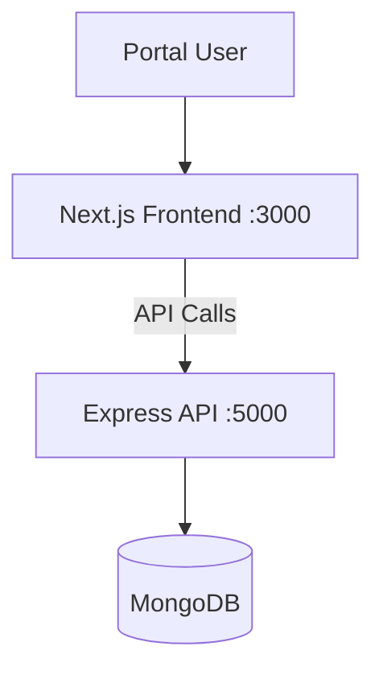

# Architecture

## 1. Architecture Overview



## 2. Frontend Architecture

- **Framework**: Next.js 14 with App Router
- **Language**: TypeScript
- **Styling**: Tailwind CSS
- **State**: React Context (Auth, Cart, Wishlist)
- **Routing**: File-based (App Router)
- **Pages**: Home, Products, Product Detail, Cart, Wishlist, Bookings, Checkout, Auth

## 3. Backend Architecture

- **Framework**: Express.js
- **Language**: TypeScript
- **Database**: MongoDB with Mongoose ODM
- **Auth**: JWT with HTTP-only cookies
- **Structure**: Controllers, Routes, Models, Middleware

## 4. Database Architecture

Models: User, Category, Product, Cart, Wishlist, Booking, Order

## 5. Authentication Flow

```
User -> Login/Register -> JWT Token -> Stored in localStorage/Cookie
API Calls -> Bearer Token Header -> Middleware Verification -> Protected Routes
```

## 6. Rental Lifecycle

```
Browse -> Select Product -> Choose Dates -> Add to Cart -> Checkout
-> Select Delivery/Pickup -> Payment + Deposit -> Confirmed
-> Delivery/Pickup -> Active Rental -> Return
-> Inspection -> Deposit Refund / Late Fee Deduction
```

## 7. API Architecture

RESTful API with:
- Public routes: Products, Categories
- Protected routes: Cart, Wishlist, Bookings, Orders, Payments
- Rate limiting: 100 requests per 15 minutes

## 8. Security

- JWT authentication with HTTP-only cookies
- Password hashing with bcryptjs (12 rounds)
- CORS configuration
- Rate limiting
- Input validation
- Helmet.js security headers
