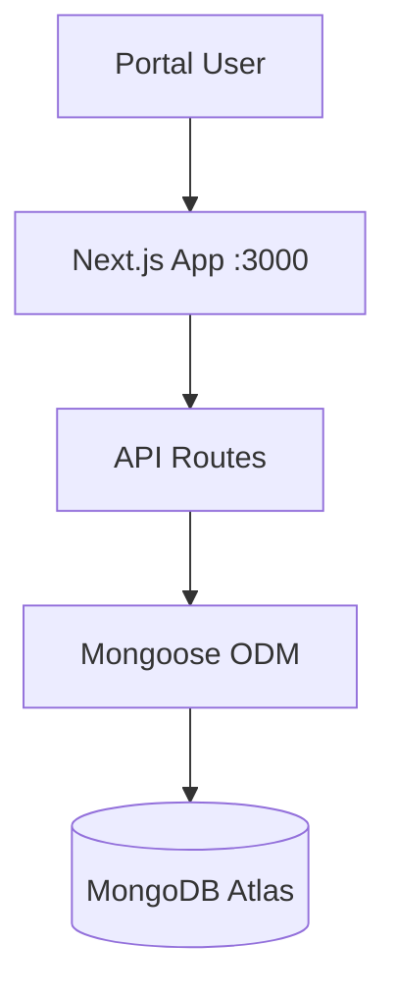

# Architecture

## 1. Architecture Overview



## 2. Frontend Architecture

- **Framework**: Next.js 14 with App Router
- **Language**: TypeScript
- **Styling**: Tailwind CSS
- **Animations**: Framer Motion
- **State**: React hooks (useState, useEffect)
- **Routing**: File-based (App Router)
- **Pages**: Home, Products, Product Detail, Cart, Wishlist, Bookings, Checkout, Auth, Profile

## 3. Backend Architecture

- **Framework**: Next.js API Routes (no separate Express server)
- **Language**: TypeScript
- **Database**: MongoDB Atlas via Mongoose ODM
- **Auth**: NextAuth.js with JWT strategy (credentials provider)
- **Structure**: API routes in `src/app/api/`, Mongoose models in `src/models/`

## 4. Database Architecture

Mongoose Models: User, Category, Product, Cart, Booking, Order

## 5. Authentication Flow

```
User -> Login (email/password) -> NextAuth credentials provider -> JWT issued
API Routes -> getServerSession(authOptions) -> JWT verification -> Protected routes
```

## 6. Rental Lifecycle

```
Browse -> Select Product -> Choose Dates -> Add to Cart -> Checkout
-> Select Delivery/Pickup -> Payment + Deposit -> Confirmed
-> Delivery/Pickup -> Active Rental -> Return
-> Inspection -> Deposit Refund / Late Fee Deduction
```

## 7. API Architecture

RESTful API routes under `/api/`:
- Public routes: Products, Categories
- Protected routes: Cart, Wishlist, Bookings, Orders, Profile
- Auth: NextAuth.js credential-based login

## 8. Security

- NextAuth.js JWT authentication
- Password hashing with bcryptjs
- Server-side session validation via getServerSession()
- Input validation with Zod
